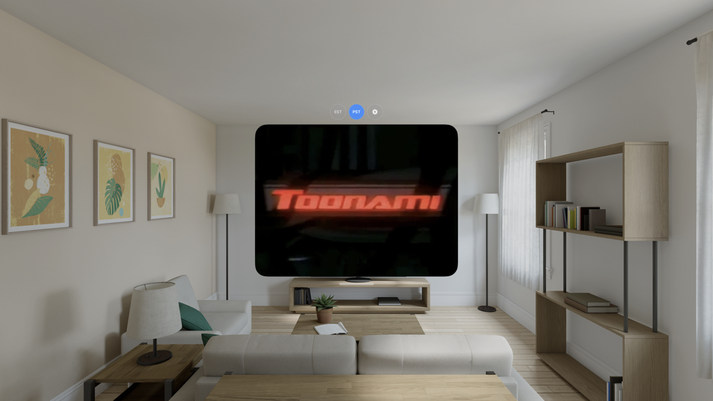

<p align="center">
  
</p>

# Aftermath

A minimal 4:3 aspect ratio visionOS streaming app for Apple Vision Pro. Designed with Toonami Aftermath in mind, but works with any HLS streaming source.

**Note:** This app does not provide stream URLs. Users must find and supply their own m3u8 links.

## Features

- **Dual Channel Support** - Switch between two configurable streaming channels (EST/PST)
- **Configurable URLs** - Set your own HLS stream URLs through an intuitive settings interface
- **Persistent Configuration** - Your stream URLs are automatically saved and restored
- **4:3 Aspect Ratio** - Window perfectly hugs the video content with no wasted space
- **Ornament Controls** - Channel switcher and settings float outside the video window

# Usage

## First Launch

On first launch, the app starts with empty stream URLs. You'll need to configure them:

1. Tap the **settings icon (⚙️)** in the ornament above the video
2. Enter your HLS stream URLs for EST and PST channels
3. Tap **"Done"** to save
4. Select a channel (EST or PST) to start streaming

## Controls

- **EST/PST Buttons** - Switch between configured channels
- **Settings Button (⚙️)** - Configure stream URLs
- **Tap Video** - Show/hide pause/play control
- **Pause/Play Icon** - Auto-hides after 2 seconds while playing

# Building From Source

## Requirements

- Xcode 15.0 or later
- Tested on Vision OS 26.2 Beta

## Installation

1. Clone the repository:
```bash
git clone git@github.com:ralewis85/aftermath.git
cd aftermath
```

2. Open the project in Xcode:
```bash
open aftermath.xcodeproj
```

3. Select your target device (Vision Pro or Simulator)

4. Build and run (⌘R)

## Support

If you're interested in more projects like this, consider [leaving a tip](https://ko-fi.com/neovisiondev) ☕

## License

Distributed under the MIT license.

## Contributing

Contributions are welcome! Feel free to submit pull requests.

